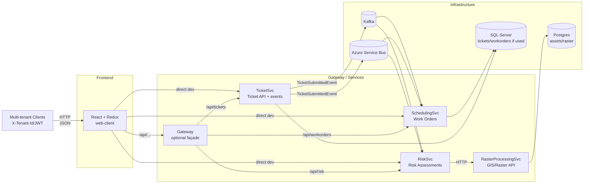

# Damage Prevention SaaS – Multi-Tenant DDD Microservice Suite

A small, production-style damage prevention platform inspired by 811 / KorTerra workflows.

## Services

- **TicketSvc** – multi-tenant dig ticket intake & publishing  
- **SchedulingSvc** – work order scheduling per tenant  
- **RiskSvc** – risk scoring & analytics (with optional GIS hook)  
- **RasterProcessingSvc** – GIS/raster analysis helper  
- **Gateway** – API gateway façade (optional)  
- **Web Client** – React + Redux dashboard for tenants  

## Architecture

- SaaS + multi-tenant  
- **DDD-styled** (Domain-Driven Design)  
- **CQRS** + **MediatR**  
- Event-driven via **Kafka** or **Azure Service Bus**  
- Wired with **Dependency Injection** and **options-based configuration**  

## Architecture Diagram



**Notes:**

- `Api/` contains HTTP endpoints, middleware, and tenant-aware logic.  
- `Application/` contains the CQRS/MediatR layer: commands, queries, DTOs, and cross-cutting behaviors.  
- `Domain/` contains core business logic: aggregates, domain events, and repository interfaces.  
- `Infrastructure/` provides concrete implementations: EF repositories, event publishers, GIS adapters, etc.  
- `Program.cs` is the composition root where services are wired with DI.  
- `appsettings*.json` are configuration files for different environments.  

## Tech Stack & Cross-Cutting Patterns

### Backend

- **.NET 9** – ASP.NET Core minimal-style Web APIs  
- **MediatR (v11)** – Implements CQRS:
  - Command handlers (write)
  - Query handlers (read)
  - Pipeline behaviors (e.g., multi-tenant enforcement)

- **DDD-style layering**:
  - **Api** → HTTP, controllers, tenancy middleware  
  - **Application** → Use cases (commands/queries)  
  - **Domain** → Aggregates, domain services, repository abstractions  
  - **Infrastructure** → Persistence, messaging, external integrations  

### Multi-Tenancy

- Tenant resolved from `X-Tenant-Id` header (and later JWT claims)  
- `ITenantProvider` + `TenantBehavior<TRequest, TResponse>`  
- Tenant-aware requests implement `ITenantScopedRequest`  

### Messaging

- **Kafka** via `Confluent.Kafka`  
- **Azure Service Bus** via `Azure.Messaging.ServiceBus`  

- Centralized configuration in `SharedKernel.Options.TicketEventsOptions`:

```json
"TicketEvents": {
  "UseKafka": true,
  "UseAzureServiceBus": false,
  "Kafka": {
    "BootstrapServers": "localhost:9092",
    "TicketSubmittedTopic": "ticket-submitted",
    "GroupId": "risk-consumers"
  },
  "AzureServiceBus": {
    "ConnectionString": "...",
    "TopicName": "ticket-submitted",
    "SubscriptionName": "risk-svc"
  }
}
```
### SharedKernel

The `SharedKernel` contains cross-cutting utilities, abstractions, and strongly-typed configuration shared across services.

- **IDateTime / SystemClock** – Provides a testable abstraction for the current time.  
- **Strongly-typed options** – Centralized configuration objects, e.g.:
  - `TicketEventsOptions` (Kafka + Azure Service Bus)  
- **Global config & utilities** – Any settings or helpers that need to be reused across services.

### Frontend

- **React + TypeScript + Vite**  
- **Redux Toolkit** for state slices:
  - `ticketsSlice`
  - `workOrdersSlice`
  - `riskSlice` (optional)
- **Shared UI components**:
  - `TicketDashboard`
  - `WorkOrderDashboard`
  - `RiskDashboard`
  - Pagination, Modal, RiskBadge, DashboardSummary
- **API client**:
  - Axios instance automatically adds `X-Tenant-Id` header per request (e.g., `acme-corp`)
  - Configurable base URLs for each backend service

### Infrastructure

- **Kafka + Zookeeper** via Docker  
- **Postgres** for GIS/raster data (used by `RasterProcessingSvc`)  
- **SQL Server** for relational data (tickets/work orders, if wired)  
- **Adminer** for database inspection


## Service Responsibilities

### TicketSvc – Multi-Tenant Ticket Intake
**Responsibilities**
- Multi-tenant ticket intake (`POST /api/tickets`)  
- Store tickets as aggregates (tenancy enforced)  
- Publish `TicketSubmittedEvent` to Kafka or Azure Service Bus  
- Tenant enforcement via:
  - `X-Tenant-Id` header
  - `ITenantProvider`
  - `TenantBehavior<TRequest,TResponse>`


### SchedulingSvc – Work Orders & Scheduling
 **Responsibilities**
 - Consume TicketSubmittedEvent (Kafka/ASB)
 - Create work orders per ticket for a given tenant
 - Allow updating work order status (completed/cancelled)
 - Expose read model for FE work orders table

### RiskSvc – Risk Scoring & Analytics
 **Responsibilities**
Consume TicketSubmittedEvent and compute a risk assessment
Optionally integrate with RasterProcessingSvc for GIS/raster context
Expose API for listing risk assessments and querying per ticket