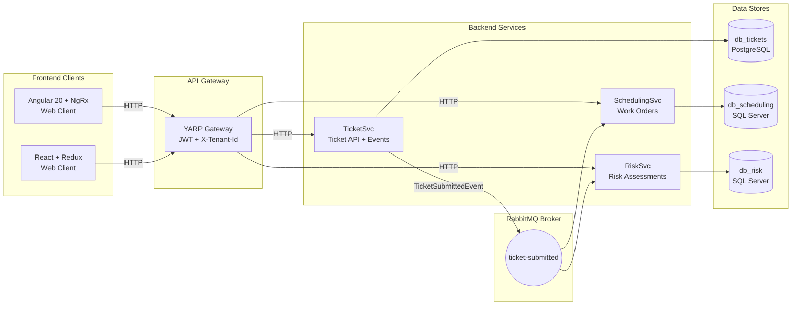

# Damage Prevention SaaS – Multi-Tenant DDD Microservice Suite

A small, production-style damage-prevention platform built using multi-tenant DDD, CQRS, and event-driven microservices powered by MassTransit + RabbitMQ, with two frontend clients:

## Services
- **TicketSvc** – tenant-aware dig ticket intake & event publication
- **SchedulingSvc** – automated work order creation & scheduling
- **RiskSvc** – risk scoring, hazard analysis, tenant-scoped analytics
- **Gateway** – YARP-based API gateway façade (JWT + multi-tenant headers)
- **Web Client** – React and Angular dashboards → Gateway (YARP)

## Architecture
- SaaS + multi-tenant  
- **DDD-styled** (Domain-Driven Design)  
- **CQRS** + **MediatR**  
- Event-Driven microservices using MassTransit + RabbitMQ 
- Consistent folder structure across all services
- Configurable via appsettings.json + DI




[](https://github.com/Sbadhon/Damage-Prevention/actions/workflows/ci-cd.yml)

## CI/CD Pipeline (GitHub Actions)
**Trigger Conditions** 
 - Every push / PR to main or develop
 - Every tag matching v* (e.g., v1.0.0)

 **What the pipeline does** 
 - What the pipeline does
 - Restores .NET dependencies
 - Builds solution in Release mode
 - Runs all backend automated tests
 - Runs Angular frontend tests in CI mode
 - On version tags:
     - Publishes backend services
     - Uploads artifacts
     - Creates a GitHub Release automatically

**Notes:**
  - `Api/` contains HTTP endpoints, middleware, and tenant-aware logic.  
  - `Application/` contains the CQRS/MediatR layer: commands, queries, DTOs, and cross-cutting behaviors.  
  - `Domain/` contains core business logic: aggregates, domain events, and repository interfaces.  
  - `Infrastructure/` provides concrete implementations: EF repositories, event publishers.  
  - `Program.cs` is the composition root where services are wired with DI.  
  - `appsettings*.json` are configuration files for different environments.  

## Tech Stack & Cross-Cutting Patterns
### Backend
**.NET 9** – ASP.NET Core Clean architecture  
**MediatR (v11)** – Implements CQRS:
  - Command handlers (write)
  - Query handlers (read)
  - Pipeline behaviors (e.g., multi-tenant enforcement)
**DDD-style layering**:
  - **Api** → HTTP, controllers, tenancy middleware  
  - **Application** → Use cases (commands/queries)  
  - **Domain** → Aggregates, domain services, repository abstractions  
  - **Infrastructure** → Persistence, messaging

### Multi-Tenancy
- Tenant resolved from `X-Tenant-Id` header (and later JWT claims)  
- `ITenantProvider` + `TenantBehavior<TRequest, TResponse>`  
- Tenant-aware requests implement `ITenantScopedRequest`  

### Messaging (MassTransit + RabbitMQ)
All microservices communicate over RabbitMQ using MassTransit.
**Events Published**
 - TicketSubmittedEvent (from TicketSvc)

**Consumers**
 - SchedulingSvc listens for TicketSubmittedEvent
 - RiskSvc listens for TicketSubmittedEvent

Local/production RabbitMQ brokers supported
### SharedKernel

The `SharedKernel` contains cross-cutting utilities, abstractions, and strongly-typed configuration shared across services.

- **IDateTime / SystemClock** – Provides a testable abstraction for the current time.  
- **Strongly-typed options** – Centralized configuration objects, e.g.:
  - `TicketEventsOptions` 
- **Global config & utilities** – Any settings or helpers that need to be reused across services.

### Frontend
**React + TypeScript + Vite**  
**Redux Toolkit** for state slices:
  - `ticketsSlice`
  - `workOrdersSlice`
  - `riskSlice`
**Shared UI components**:
  - `TicketDashboard`
  - `WorkOrderDashboard`
  - `RiskDashboard`
  - Pagination, Modal, RiskBadge, DashboardSummary
**Gateway** – YARP-based API gateway façade (JWT + multi-tenant headers)
**API client**:
  - Axios instance automatically adds `X-Tenant-Id` header per request (e.g., `acme-corp`)
  - Single configurable base URL for the API Gateway (e.g., `VITE_API_GATEWAY_URL=http://localhost:5117`)
  - Gateway fans out to TicketSvc, SchedulingSvc, and RiskSvc

**Angular 20 (Standalone Components) + TypeScript + Vite**  
**NgRx** Store for state management:
  - `Tickets state`
  - `Work Orders state`
  - `Risk state`
**Material** UI components
  - Dialogs
  - Tables
  - Selects
  - Status badges
  - Dashboard widgets
**UI components**:
  - `TicketDashboard`
  - `WorkOrderDashboard`
  - `RiskDashboard`
  - Pagination, Modal, RiskBadge, DashboardSummary
**Gateway** – YARP-based API gateway façade (JWT + multi-tenant headers)
**API client**:
  - Every Angular HttpClient request automatically sends `X-Tenant-Id` header per request (e.g., `acme-corp`)
  - Single configurable base URL for the API Gateway (e.g., `VITE_API_GATEWAY_URL=http://localhost:5117`)
  - Gateway fans out to TicketSvc, SchedulingSvc, and RiskSvc

## Service Responsibilities
### TicketSvc – Multi-Tenant Ticket Intake
**Responsibilities**
 - Creates & manages dig tickets
 - Tenant-scoped CRUD operations
 - Publishes TicketSubmittedEvent via RabbitMQ
 - Enforces tenant boundaries in domain & database

### SchedulingSvc – Automated Work Order Scheduling
 **Responsibilities**
 - Subscribes to TicketSubmittedEvent
 - Creates tenant-scoped work orders
 - Allows completion/cancellation
 - Exposes list views for the UI

### RiskSvc – Ticket Risk Assessment
 **Responsibilities**
 - Subscribes to TicketSubmittedEvent
 - Computes a risk score (work-type based rules)
 - Stores tenant-scoped risk assessments
 - Provides endpoints to:
 - Get risk by ticket
 - List risk assessments

 ### Local Development
 ```bash
 {
  docker compose up -d   # starts rabbitmq + dbs
  dotnet run             # from each service folder
  npm install            # inside web-client-angular
  npm run dev            # from web-client / web-client-angular folder
 }
 ```

  ### Summary
  This platform is:
  - Multi-tenant
  - Event-driven
  - RabbitMQ-powered
  - DDD-oriented
  - CQRS/MediatR structured
  - Horizontally scalable

Every service is autonomous, consistent in structure, and communicates ONLY via MassTransit RabbitMQ events.